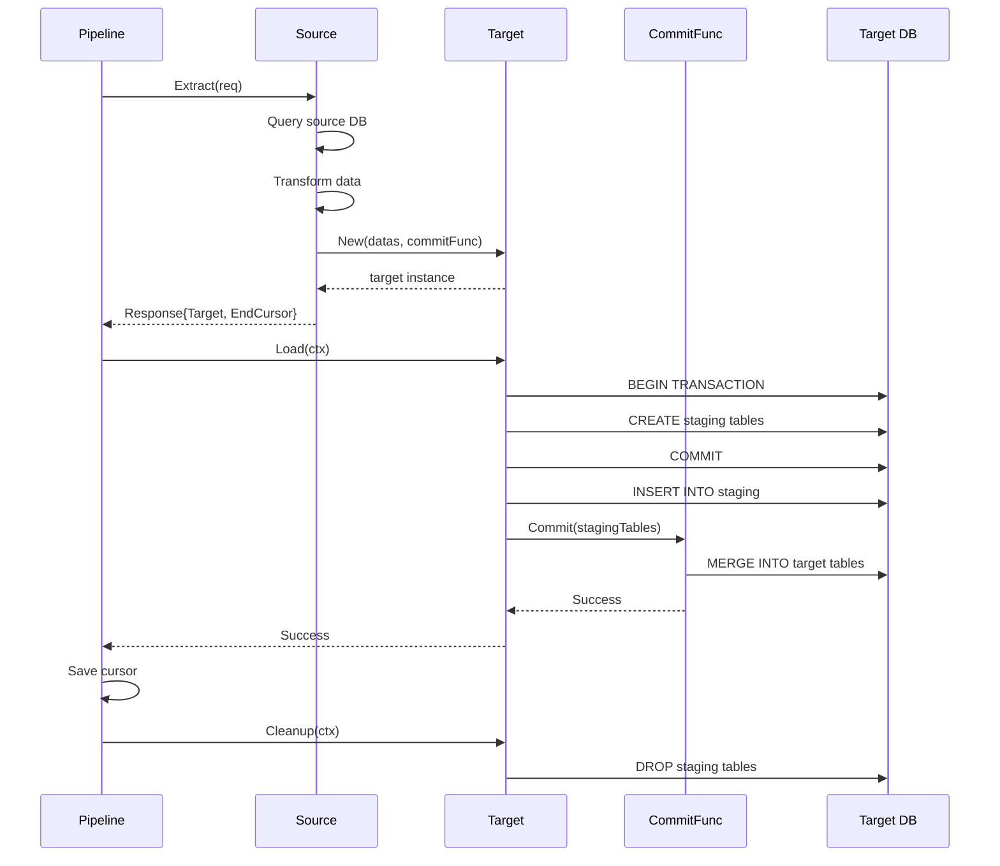

# ETL

A type-safe, reliable ETL (Extract, Transform, Load) framework for Go with built-in pagination, circuit breaker, and PostgreSQL support.

## Features

- **Type-Safe Cursors**: Generic-based cursor implementation for compile-time safety
- **Queue-Based Processing**: Built on `go-que` for reliable job processing
- **Circuit Breaker**: Automatic failure detection and recovery mechanism
- **Pagination Support**: Efficient data processing with configurable page sizes
- **PostgreSQL Target**: Built-in support for PostgreSQL with staging tables
- **Transaction Safety**: Atomic commits with rollback support
- **Incremental Sync**: Process only changed data with cursor-based tracking
- **Error Notification**: Pluggable error notification system
- **Retry Policy**: Configurable retry mechanisms for transient failures
- **Multi-Table Support**: Process multiple related tables in a single extraction

## Installation

```bash
go get github.com/theplant/etl
```

## Quick Start

```go
package main

import (
    "context"
    "database/sql"
    "fmt"
    "time"

    "github.com/qor5/go-bus"
    "github.com/theplant/etl"
    "github.com/theplant/etl/pgtarget"
    "gorm.io/gorm"
)

type MySource struct {
    sourceDB *gorm.DB
    targetDB *gorm.DB
}

func (s *MySource) Extract(ctx context.Context, req *etl.ExtractRequest[*etl.Cursor]) (*etl.ExtractResponse[*etl.Cursor], error) {
    // 1. Extract data from source (query with cursor pagination)
    var users []SourceUser
    // ... query users with req.After, req.FromAt, req.BeforeAt

    // 2. Transform to target format (multiple tables)
    datas := etl.TargetDatas{
        {Table: "identities", Records: transformedIdentities},
        {Table: "credentials", Records: transformedCredentials},
    }

    // 3. Create target
    target, err := pgtarget.New(s.targetDB, req, datas, s.commit)
    if err != nil {
        return nil, err
    }

    // 4. Return response with cursor
    return &etl.ExtractResponse[*etl.Cursor]{
        Target:      target,
        EndCursor:   &etl.Cursor{At: lastUpdateTime, ID: lastUserID},
        HasNextPage: len(users) > req.First,
    }, nil
}

func (s *MySource) commit(ctx context.Context, input *pgtarget.CommitInput[*etl.Cursor]) (*pgtarget.CommitOutput[*etl.Cursor], error) {
    // Merge identities
    identitiesStaging := input.StagingTables["identities"]
    if err := input.DB.Exec(fmt.Sprintf(`
        MERGE INTO identities AS t
        USING %s AS s
        ON t.id = s.id
        WHEN MATCHED AND s.updated_at > t.updated_at THEN
            UPDATE SET name = s.name, email = s.email, updated_at = s.updated_at
        WHEN NOT MATCHED THEN
            INSERT (id, name, email, created_at, updated_at)
            VALUES (s.id, s.name, s.email, s.created_at, s.updated_at)
    `, identitiesStaging)).Error; err != nil {
        return nil, err
    }

    // Merge credentials
    credentialsStaging := input.StagingTables["credentials"]
    if err := input.DB.Exec(fmt.Sprintf(`
        MERGE INTO credentials AS t
        USING %s AS s
        ON t.id = s.id
        WHEN MATCHED AND s.updated_at > t.updated_at THEN
            UPDATE SET identity_id = s.identity_id, value = s.value, updated_at = s.updated_at
        WHEN NOT MATCHED THEN
            INSERT (id, identity_id, value, created_at, updated_at)
            VALUES (s.id, s.identity_id, s.value, s.created_at, s.updated_at)
    `, credentialsStaging)).Error; err != nil {
        return nil, err
    }

    return &pgtarget.CommitOutput[*etl.Cursor]{}, nil
}

func main() {
    ctx := context.Background()

    pipeline, err := etl.NewPipeline(&etl.PipelineConfig[*etl.Cursor]{
        Source:                  &MySource{sourceDB: sourceDB, targetDB: targetDB},
        QueueDB:                 pipelineDB,
        QueueName:               "my_etl",
        PageSize:                100,
        Interval:                5 * time.Minute,
        ConsistencyDelay:        10 * time.Second,
        RetryPolicy:             bus.DefaultRetryPolicyFactory(),
        CircuitBreakerThreshold: 3,
        CircuitBreakerCooldown:  5 * time.Minute,
    })
    if err != nil {
        panic(err)
    }

    controller, err := pipeline.Start(ctx, &etl.Cursor{})
    if err != nil {
        panic(err)
    }
    defer controller.Stop(ctx)

    select {}
}
```

For a complete real-world example with multi-table ETL, see [pipeline_test.go](https://github.com/theplant/etl/blob/main/pipeline_test.go) which demonstrates an identity system syncer handling Users, Credentials, and CredentialIdentifiers across multiple tables.

## Core Concepts

### Source

The `Source` interface defines how to extract data from your source system:

```go
type Source[T any] interface {
    Extract(ctx context.Context, req *ExtractRequest[T]) (*ExtractResponse[T], error)
}
```

- **Type Parameter `T`**: Your cursor type (e.g., `*etl.Cursor`, `string`, `int64`)
- **Extract Request**: Contains pagination (`First`, `After`) and time range (`FromAt`, `BeforeAt`)
- **Extract Response**: Returns prepared target, end cursor, and pagination info

### Target

The `Target` interface defines how to load data into your target system:

```go
type Target interface {
    Load(ctx context.Context) error
    Cleanup(ctx context.Context) error
}
```

The `pgtarget` package provides a PostgreSQL implementation with:

- Automatic staging table creation
- Batch inserts with transaction support
- Custom commit logic via `CommitFunc`
- Automatic cleanup on success

### Cursor

Cursors track processing progress and enable incremental sync:

```go
type Cursor struct {
    At time.Time `json:"at"`
    ID string    `json:"id"`
}
```

You can use the built-in `Cursor` or define your own type-safe cursor.

### Pipeline

The `Pipeline` orchestrates the entire ETL process:

1. **Initialization**: Sets up queue and validates configuration
2. **Job Scheduling**: Creates periodic jobs based on `Interval`
3. **Extraction**: Calls source's `Extract` method with cursor
4. **Loading**: Executes target's `Load` method
5. **Cursor Update**: Saves progress for next run
6. **Error Handling**: Applies retry policy and circuit breaker logic

### Circuit Breaker

Prevents resource exhaustion during persistent failures:

- Tracks consecutive skipped jobs
- Opens circuit when threshold is reached
- Schedules cooldown job to attempt recovery
- Notifies on circuit breaker state changes

## Advanced Usage

### Custom Cursor Types

Use your own cursor type for specific tracking needs:

```go
type MyCursor struct {
    Timestamp time.Time
    Offset    int64
    ShardID   string
}

func (c *MyCursor) String() string {
    return fmt.Sprintf("%s_%d_%s",
        c.Timestamp.Format(etl.TimeLayout),
        c.Offset,
        c.ShardID)
}

// Use custom cursor type
pipeline, err := etl.NewPipeline(&etl.PipelineConfig[*MyCursor]{
    Source: &MySource{},
    // ... other config
})
```

### Staging Table Hooks

Customize staging table creation:

```go
target, err := pgtarget.New(db, req, datas, commitFunc)

// Add custom hook for staging table creation
target.AddCreateStagingTableHook(func(ctx context.Context, input *pgtarget.CreateStagingTableInput[*etl.Cursor]) (*pgtarget.CreateStagingTableOutput, error) {
    // Custom table creation logic
    customTable := fmt.Sprintf("%s_custom", input.StagingTable)

    query := fmt.Sprintf(`
        CREATE TEMP TABLE %s (
            LIKE %s INCLUDING ALL
        ) ON COMMIT DROP
    `, customTable, input.TargetTable)

    if err := input.Tx.Exec(query).Error; err != nil {
        return nil, err
    }

    return &pgtarget.CreateStagingTableOutput{
        StagingTable: customTable,
    }, nil
})
```

### Error Notifications

Integrate with your error notification system:

```go
type MyNotifier struct{}

func (n *MyNotifier) Notify(err error, req interface{}, tags map[string]any) error {
    // Send to Sentry, Airbrake, etc.
    log.Printf("ETL Error: %+v, Tags: %+v", err, tags)
    return nil
}

pipeline, err := etl.NewPipeline(&etl.PipelineConfig[*etl.Cursor]{
    // ... other config
    Notifier: &MyNotifier{},
})
```

## Architecture

### Data Flow



### Queue-Based Processing

The pipeline uses `go-que` for:

- **Reliable Scheduling**: Jobs persist across restarts
- **Concurrency Control**: Single active job per queue
- **Retry Logic**: Exponential backoff for failures
- **Job Priority**: FIFO with scheduled run times

## Best Practices

1. **Idempotency**: Ensure your commit logic handles duplicate runs
2. **Cursor Design**: Include both timestamp and ID for uniqueness
3. **Page Size**: Balance between throughput and memory usage
4. **Consistency Delay**: Account for eventual consistency in source systems
5. **Error Handling**: Wrap errors with context for debugging
6. **Monitoring**: Use the notifier for critical error alerting
7. **Testing**: Test with real databases using `testcontainers`

## License

MIT License - see [LICENSE](LICENSE) file for details
